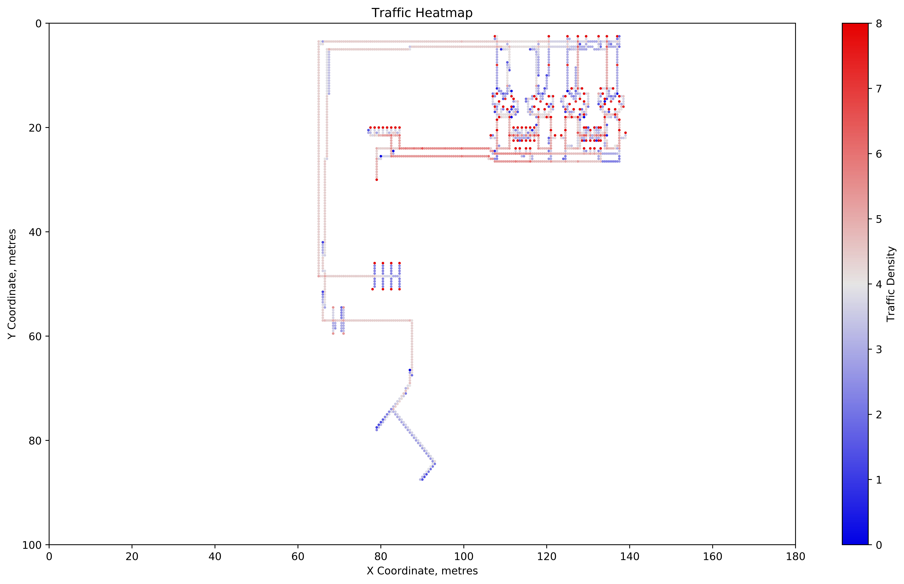
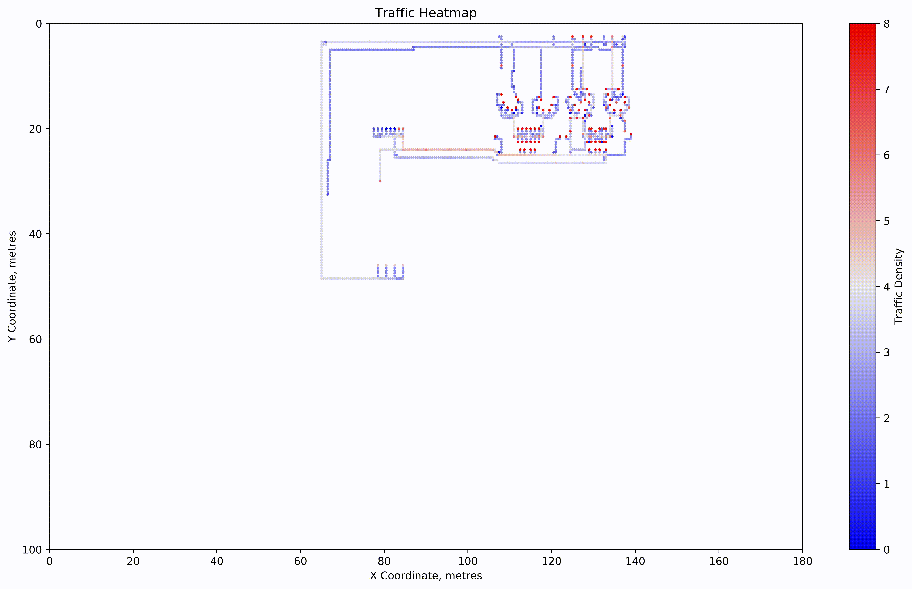

# heatmap_visualiser

## The repo holds a few python scripts which processes x, y robot traffic coordinates collected over a  period of time and displays the data in a scatter plot

The heatmap_visualiser.py will

1) Call `csv_interpreter.py` to read the given CSV file, extracted from the simulated traffic movement. The `csv_interpreter.py` also cleans up the key value variable type as well as sets the value granularity(x, y coordinates) to be used in `heatmap_visualiser.py`

2) Process the data logged in the CSV file

3) Plot the data into scatter plot for visualisation of the traffic flow

4) All the relevant plots / animation will be saved in sub-folders found in the `img/` folder. The saved folders will follow the respective naming convention [YYYYMMDD_HHMM]

** The `plot_ColorContrast.py` is an added function to make adjustments to the color contrast of the Traffic Density scale. This is to make the plots more visable
** The background of the plot can be modified within the `heatmap_visualiser.py` under the `imread` function in line 107.

##  ** How to run **

run `python heatmap_visualiser <*.csv file> <plot mode value>`

### plot mode feature

The purpose of the feature is to allow the selection of data visualisation modes. The current modes are:

- Overall data visualisation: plot mode value = 0

This mode allows the user to view the collective Traffic Density over the entire dataset duration. 

- Interval Incremental visualisation: plot mode value = 1

The interval incremental visualisation is to allow the user to study the collective changes of the traffic density as the time frame increases. The time interval is currently hardcoded within the `heatmap_visualiser.py` under the `interval` variable. For this mode, an additional animation, in mp4 format, will be saved. This is to allow the user to easily compare the Traffic Density changes overtime.

